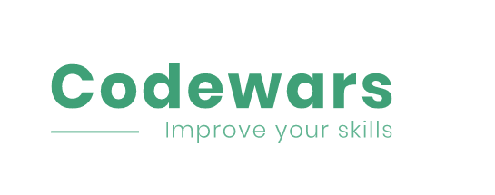

# Codewars
<p align="center"></p>

Codewars it is a learning environment that offers the user another way to learn and improve his programming skills. In this way, users face each other in real time code competitions. Those competitions not only improve his programming skills and logical thinking but also allows him to understand better what his programming level relative to other users in the world.

**Live Demo (not mobile friendly):** https://codewars-project.netlify.app/


After The registration the user must pass the Level Test which will determine his programming level and immediately afterwards he can start competing with other users around the world whose programming level is the same.


At the war page, each user can see the random challenge and the editor where he could write his code. In addition, there is a "run code" button to check the code before submitting, timer and "submit" button. After clicking on the "submit" button, the timer will start to countdown 15 seconds, It would be the maximum time for the opponent to finish his code, after a 15 seconds the answer will be submitted automatically to the assessment tool and each user will be transferred to a result page where he will get his score.


The user can navigate to his profile page and see his personal information, statistics, last wars and his friends list. Also, he can navigate to other users profile pages, send them friend requests, see theirs personal information, statistics and etc.

### Technologies
* React at the client side
* NodeJS & Express at the server side
* MongoDB & Mongoose
* Asynchronous tasks, Axios
* Socket.io
* Joi
* Nodemailer & Google API's

### How to install
Clone the repository:
```
git clone https://github.com/MariaGarber/Codewars.git
```
Enter the clonned folder:
```
cd Codewars
```
Enter the client folder:
```
cd client
```
Install the dependencies:
```
npm install
```
Run the application:
```
npm start
```
Local app should open automatically, if it is not, open the browser at http://localhost:3000/

